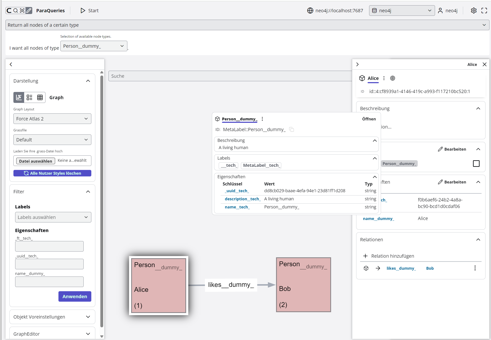

# Intro

This repo contains the GraphEditor. It is an editor for labeled property graph databases (as
provided by e.g. neo4j or memgraph).

## Status and features

The software is in its early stages - it works (for us), but lot's of features are not yet
implemented. Also expect lots of bugs :-)

Exiting main features are:

- Semantic support: all labels, relationtypes and properties can have meaningful metadata, which in
  turn can be edited and extended by the same editor - it is all stored in the graph database
- Semantic support for editing
- Persistent node arrangements (perspectives) - you can drag a selection of nodes into position, and
  store the arrangement in the database, reusable by other users
- WebGL Support (provided by sigma.js), which means we can display thousands of objects
- Rectangular nodes
- Support for styling files (.grass) that can contain python snippets for dynamic styling
- Support for fulltext search (optional)

## Screenshot



## Architecture


The editor consists of two parts:

- The frontend, written in react/typescript, that the user interacts with.
- The backend, written in python, that provdes an API that is used by the frontend, and in turn
  talks to the LPG database, mostly neo4j.

# Authors

The graph editor is produced and published by DB Systel GmbH, a 100% subsidary of Deutsche Bahn.
See [CONTRIBUTORS.md](CONTRIBUTORS.md)

Maintainers are listed in [MAINTAINERS.md](MAINTAINERS.md)

# LICENSE

GraphEditor, a gui with semantic support for labeled property graph databases

Copyright (C) 2025 DB Systel GmbH

This program is free software: you can redistribute it and/or modify it under the terms of the GNU
Affero General Public License as published by the Free Software Foundation, either version 3 of the
License, or (at your option) any later version.

This program is distributed in the hope that it will be useful, but WITHOUT ANY WARRANTY; without
even the implied warranty of MERCHANTABILITY or FITNESS FOR A PARTICULAR PURPOSE. See the GNU Affero
General Public License for more details.

See [AGPL.txt](AGPL.txt) for the full license.

# Contributions, updates and contact

See [CONTRIBUTING](CONTRIBUTING.md)

# Updates and contributions

This repo is a partial copy of our internal repo. We try to update this repo whenever we cut a new
release.

You are welcome to send us merge requests.

# Running it

## Docker

- Docker must be installed
- copy .env.dist into .env and change the variables according to your system.

To build the docker images, run `sh build.sh dev` (or `sh build.sh prod` for production).

To run a dev server for backend and frontend, run `docker-compose up`  (see /frontend/README.md if
you are working with GUI).

If you need mock data to explore the project, please visit http://localhost:4999/api/swagger. Before
starting, make sure you are logged in using the GUI interface. Then, under the headline "Dev tools",
chose one of the entries "reset" (simple database with Alice, Bob and a meta model) and "osm_data".
Click on "Try it out", type an arbitrary "x-tab-id" and execute it to get mock data.

**Caution**: this will replace all your data in the neo4j database. Double-check you are connected
with the database you want to overwrite.

### Mac issues with allocated memory

Mac users might run into an issue with memory when starting the frontend image. To fix this,
increase the allowed allocated memory of your vm. Either in Docker-Desktop, or if using colima,
start your vm with `colima start --cpu 4 --memory 8`.

### Changes in node_modules

If you added node modules, or simply want to rebuild the image, run `docker-compose down` followed
by `docker-compose up --build`

### Mounting host directories with correct rights

Our docker-compose.yml mounts some local directories to allow persisting stuff like Neo4j data and
plugins. By default Neo4j either creates them or, if existing, changes the permissions of these
directories so that they are owned by root. If you wish to change this, you can define a local
override file, for example:

```bash
$ cat docker-compose.override.yml
services:
  neo4j-enterprise:
    user: "1000:1000"
```

## .exe

An executable can be build using pyinstaller.

Build the frontend using `npm run build`, and copy the contents of the dist folder to the gui folder
in the backend. Then, within the backend folder run:

`pyinstaller --onefile --add-data 'index.html:.' --add-data 'static:static' --add-data 'gui:gui' 
--add-data '<... YOUR BASE PATH ...>\\venv312\\Lib\\site-packages\\flask_smorest\\spec:flask_smorest
' -i gui/IGA_Favicon.ico -n IGA_Editor_0_2_alpha_1 main.py
`

When executing the .exe, the urls to access are displayed in the console window.

## Directly

You can run the frontend and backend directly. Please check

- [Frontend README](frontend/README.md)
- [Backend README](backend/README.md)


