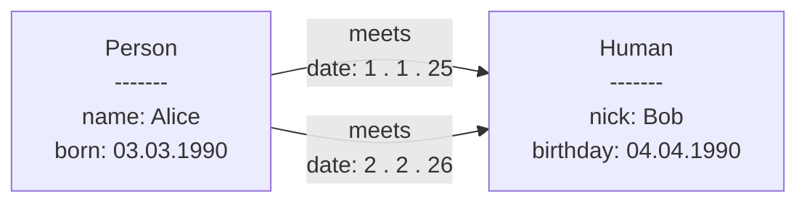
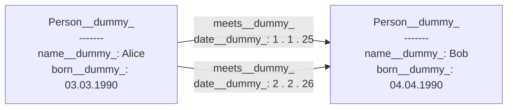
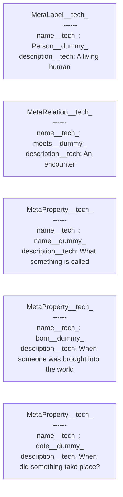
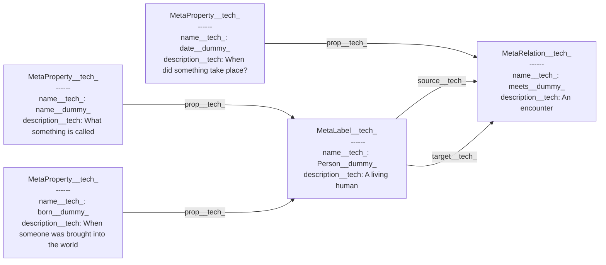
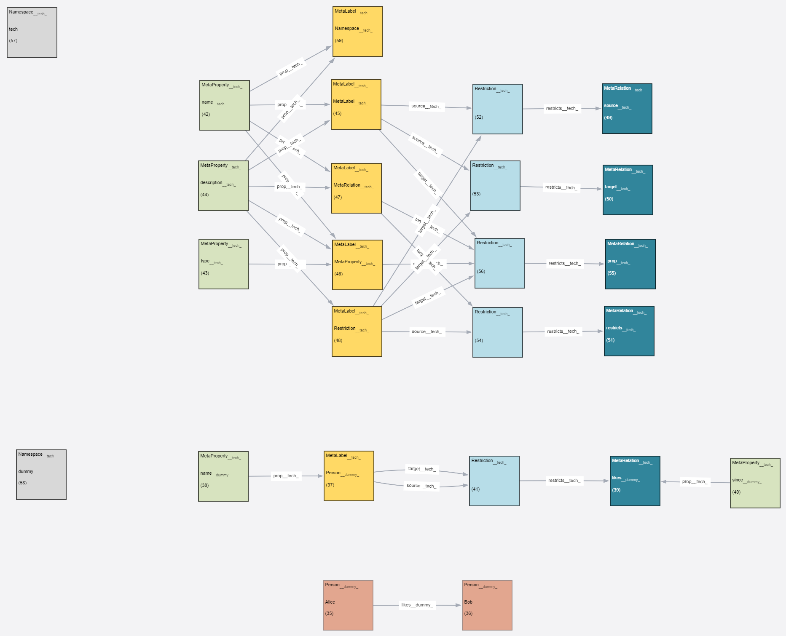

# Problem

In a labeled property graph we have nodes with labels, relationships with types, and both can have
properties.

What do they mean? What do they imply?

| Question                                            |
|-----------------------------------------------------|
| What does a label mean?                             |
| What does a relation type mean?                     |
| What does a property mean?                          |
| What properties *should* a label have?              |
| What properties *should* a type have?               |
| What label combinations ** should ** a type relate? |

# Solution

## Idea

We write the meaning of labels, types and properties into nodes in the graph database. We have
defined relations between those nodes.

## Considerations

The solution need to fullfill the following criteria:

- Easy to understand
    - like neo4j is compared to RDF
- Defined within a neo4j database
    - We don't want to sync with all the mapping problems
    - We don't want immediate effect
- Open World Assumption
- Think "maybe, should & could"
    - Neo4j is schemafree, everything is possible
    - like python, think ducktyping & protocols
    - Not a logic system
- Must work with non-conforming databases
- "Namespaces are one honking great idea -- let's do more of those!"

## Instance level

As humans, we understand the image immediately: we have Alice and Bob, both are a Person, and Alice
meets Bob on two occasions.

Let's create a metamodel for this, but first, let us think about namespaces. Words can have
different meanings in different contexts or namespaces, e.g. bank can mean the sloping land besides
a river or the financial institution. So we add a context to each word. Here, we use the namespace "
dummy" as

## Meta level

On the meta level we need to describe the meaning of:

- Labels: Person__dummy_
- (Relation) types: meets__dummy_
- Properties: name__dummy_, born__dummy_, date__dummy_

We do these in "meta"-nodes, nodes, that describe a term:

Again, as humans, we understand the image quite easily

- MetaLabels define the meaning of labels
  - the name of the label is in name__tech_
  - the description of the label in description__tech_
- MetaRelations define the meaning of a relation types
- MetaProperties define the meaning of properties

This of course looks still a bit "isolated", so let's add some relations between our nodes:

Now we know:

- name__tech_, born__tech_ can be properties of Person__dummy_
- date__dummy_ can be a property of meets__dummy_ relation
- Person__dummy_ can be the source and target (start and end) of a meets__dummy_relation

Quite easy to read. Also for a computer system. E.g. it can now look up a label like 
Person__dummy_ and find the description for it, what properties are associated with it, and what 
relationship it could participate in. 

In relation to the questions above, the answers look like this:

| Question                                            | Answer              |
|-----------------------------------------------------|---------------------|
| What does a label mean?                             | MetaLabel__tech_    |
| What does a relation type mean?                     | MetaRelation__tech_ |
| What does a property mean?                          | MetaProperty__tech_ |
| What properties *should* a label have?              | prop__tech_         |
| What properties *should* a relation type have?      | prop__tech_         |
| What label combinations ** should ** a type relate? | Restriction__tech_  |

## Meta meta level

Now you might ask: well, if a machine can find the definition of Person__dummy_, could it also 
find a definition of MetaLabel__tech_?

Smart question, I am glad that you asked. And here we leave the world of mermaid diagrams and 
come to a screenshot, taken in the GraphEditor,  from example data that you can load there: 

You see how at the bottom we have an Alice and a Bob, how one level above their labels, types 
and properties are defined, as well as the namespace dummy? And above that you find the answer 
to your question: everything has a definition, and we use the same rules do describe the meta 
meta level. 

You probably have noted that we have "Restrictions" in the meta-data. This is for building 
combinations of sources and targets for relations that are valid or recommended.  

Please note: this is as high level as it gets. The meta meta level is self describing, so this 
really is all you need.

We invite you to upload the sample data into your neo4j, and use GraphEditor to inspect all 
nodes - it will make things a bit easer.

# Outlook / roadmap

## More detailed documentation

This documentation will evolve over the coming months

## Ontology

We see the need for having relations between the meta-nodes that allow for reasoning and 
validation. E.g. you would want to say that "Human" and "Person" are equivalent. Currently we 
see a need for the following relations on the meta level:

### Formal

| Problem      | Relation              | Bidirectional | Transitive | Inference | RDF                                    |
|--------------|-----------------------|---------------|------------|-----------|----------------------------------------|
| Hierarchy    | has_parent__tech\_    | \-            | ✓          | ✓         | rdfs:subClassOf rdfs:subPropertyOf  |
| Equivalence  | is_equivalent__tech\_ | ✓             | ✓          | ✓         | owl:equivalentClass skos:exactMatch |
| Difference   | is_different__tech\_  | ✓             | \-         | ✓         | owl:differentFrom                      |
| Inverse      | is_inverse__tech\_    | ✓             | \-         | ✓         | owl:inverseOf                          |

### Informal

| Problem     | Relation              | Bidirectional | Transitive | Inference | RDF               
|-------------|-----------------------|---------------|------------|-----------|-------------------|
| Hierarchy   | broad_match___tech\_  | \-            | \-         | \-        | skos:broadMatch   |
| Equivalence | related_match__tech\_ | ✓             | \-         | \-        | skos:relatedMatch |
| Relation    | see_also__tech\_      | \-            | \-         | \-        | rdfs:seeAlso      |

